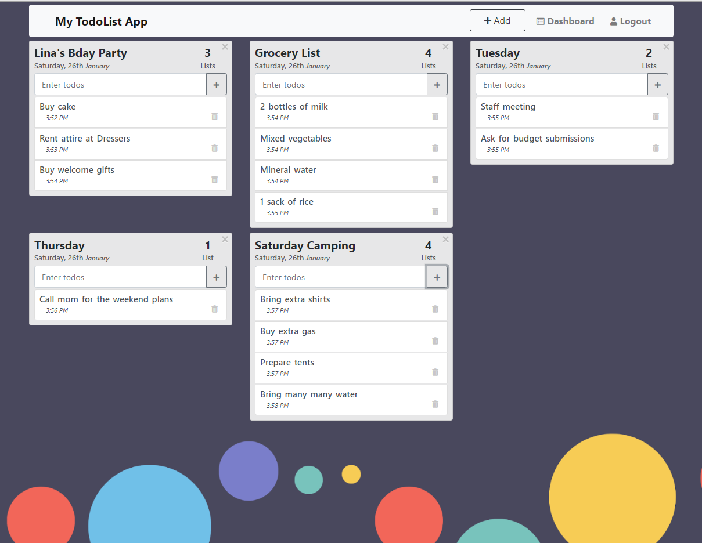

This project was bootstrapped with [Create React App](https://github.com/facebook/create-react-app).

## Multi TodoList App

I am mastering my ReactJs knowledge and created this 
Multi TodoList App with [Create React App](https://github.com/facebook/create-react-app) 
The app allows you to create multiple todolists dashboards 
each containing your todo lists and it looks like this: 

## App Features

This app allows CRUD dashboards and lists for each dashboards. 
This app requires registration and login to so that you can use. 
 
Enjoy using the app! 

